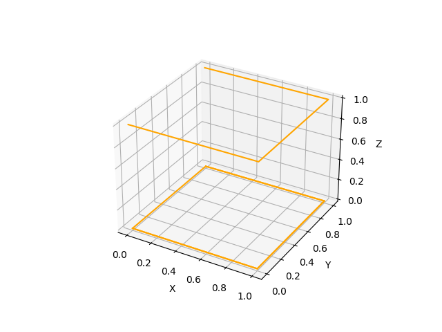
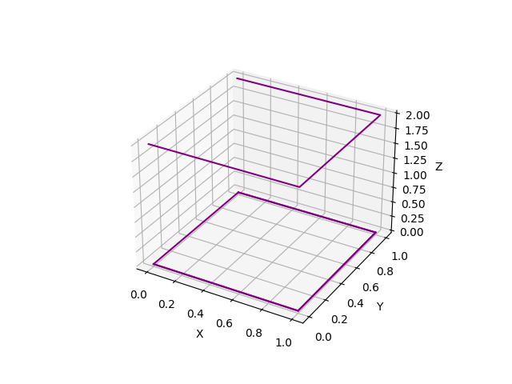

# Drawing 3D Shapes

The project is a shape visualization tool that displays various geometric shapes such as cone, cube, cuboid, cylinder, frustum, and sphere. Each shape is accompanied by a screenshot and a brief description.

## Screenshots

### Cone

A cone is a three-dimensional geometric shape that tapers smoothly from a flat base to a point called the apex or vertex. It has one curved surface and a circular base.

### Cube

A cube is a three-dimensional geometric shape with six square faces of equal size. All angles in a cube are right angles, and all edges have the same length.

### Cuboid

A cuboid, also known as a rectangular prism, is a three-dimensional geometric shape with six rectangular faces. It has opposite faces that are congruent and parallel.

### Cylinder

A cylinder is a three-dimensional geometric shape with two parallel circular bases connected by a curved surface. It has a constant radius and height.

### Frustum

A frustum is a three-dimensional geometric shape that resembles a cone with its top portion cut off. It has two parallel circular bases of different sizes connected by a curved surface.

### Sphere

A sphere is a three-dimensional geometric shape that is perfectly round in shape. It has all points on its surface equidistant from its center.

## How to Run

To run the project, follow these steps:

  1. Clone the project repository.
  2. Install any necessary dependencies specified in the project's documentation.
  3. Open the project in your preferred development environment.
  4. Build and run the project according to the provided instructions.